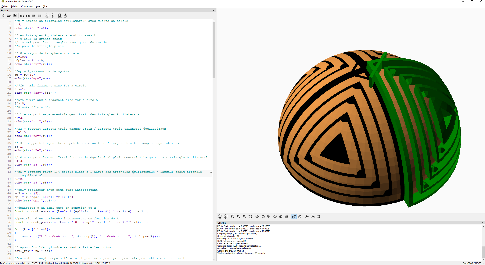

# Calebasse-africaine-avec-OpenSCAD

Le patrimoine africain en histoire des mathématiques a malheureusement été peu documenté en raison de la tradition orale. Cependant, Denis-Pierre de Pedrals donne des exemples décorations de calebasses au Tchad en 19748, dans "Antilopes et calebasses". Bien que l'approche de Pedrals soit principalement artistique, Théophile Obenga a regardé le sujet différement en 1995 dans "La géométrie égyptienne, Contribution de l'Afrique antique à la Mathématique mondiale" disponible gratuitement [ici](https://play.google.com/books/reader?id=HCjECugfQegC&pg=GBS.PP1) :

"Le potentiel géométrique de l’art décoratif du Tchad (et du reste de toute l’Afrique noire) constitue une géométrie particulière dans le monde sensible."

Il est difficile de saisir les enjeux de géométrie sphérique engagés dans la décoration des calebasses sur la base d'une représentation plane. C'est pourquoi je veux les représenter en 3D, avec OpenSCAD pour qu'elles puissent être ensuite intégrées à des projets plus ambitieux.

Porndouï est une représentation symbolique des ailes striées de l'épervier. On notera ici le jeu visuel avec des triangles sphériques équilatéraux trirectangles (dont les 3 angles sont droits).

# African-calabash-with-OpenSCAD

African heritage in history of mathematics is unfortunately poorly documented due to oral tradition. However, Denis-Pierre de Pedrals's "Antilopes et calebasses" (1948, never translated in english) gives some examples of calabashes decorations in Tchad. Though Pedrals's view is mostly artistic, Théophile Obenga, casted a new light on this topic in 1995, in "La géométrie égyptienne, Contribution de l'Afrique antique à la Mathématique mondiale" (Egyptian geometry, contribution of ancient Africa to world mathematics" freely available [here](https://play.google.com/books/reader?id=HCjECugfQegC&pg=GBS.PP1) : 

"Le potentiel géométrique de l’art décoratif du Tchad (et du reste de toute l’Afrique noire) constitue une géométrie particulière dans le monde sensible." (Geometrical power of Tchad (and black Africa in general) decorative art represents a specific geometry in the sensory world.).

It is quite difficult to apprehend the spherical geometry involved in calabashes decoration based on 2D representations. That is why I represented them in 3D, using OpenSCAD so that they can be later included in more ambitious projects.

Porndouï is a symbolic representation of the striped hawk wings. There is a visual effect with spherical equilateral triangles that have 3 right angles.z
